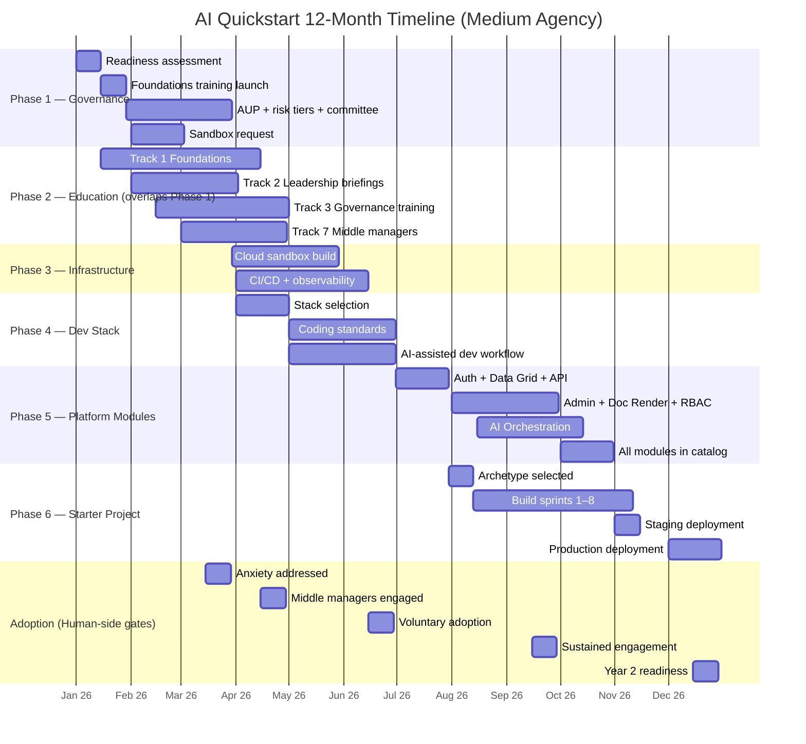

> **What this page is.** A consolidated view of the timeline, the gates that prove progress, and the hard dependencies you cannot skip. The Gantt at the bottom of this page renders directly from Mermaid source — copy it into any Mermaid renderer (e.g., [mermaid.live](https://mermaid.live)) for slide decks or printed playbooks.

## The 12-month picture

The playbook is calibrated for a **medium-size agency** (5–15 IT staff). Small agencies should plan for ~18 months and use the off-ramps deliberately; large agencies can compress to ~9 months. See the three [case studies](/resources/case-studies/) for what each pace looks like in practice.

| Quarter    | Phase focus                                       | Milestone gates cleared by end of quarter |
| ---------- | ------------------------------------------------- | ----------------------------------------- |
| Q1 (1–3)   | Governance + Education start                      | G-01, G-02, G-03, G-04 + H-01             |
| Q2 (4–6)   | Infrastructure operational + Dev Stack standards  | G-05, G-06, G-07, G-08 + H-02, H-03       |
| Q3 (7–9)   | First 3 platform modules + Starter project chosen | G-09, G-10, G-11 + H-04                   |
| Q4 (10–12) | All 7 modules + first AI app in production        | G-12, G-13, G-14 + H-05                   |

## The 14 technical milestone gates

Every gate has an evidence requirement that is both observable and falsifiable. If you cannot point to the evidence on the right, the gate is not cleared — regardless of how much work has been done.

### Q1 — Foundation (Months 1–3)

| Gate | Milestone                        | Target  | Evidence Required                                                                                             |
| ---- | -------------------------------- | ------- | ------------------------------------------------------------------------------------------------------------- |
| G-01 | AI Readiness Assessment Complete | Week 2  | Scorecard completed by IT lead and executive sponsor; current maturity level documented                       |
| G-02 | AI Foundations Training Launched | Month 1 | First Track 1 session delivered; attendance recorded; post-session survey collected                           |
| G-03 | Governance Framework Adopted     | Month 3 | AUP signed by leadership, risk tiers defined with examples, review committee chartered and first meeting held |
| G-04 | Cloud Sandbox Requested          | Month 2 | Sandbox provisioning request submitted with governance approval; budget allocated                             |

### Q2 — Build the Base (Months 4–6)

| Gate | Milestone               | Target  | Evidence Required                                                                          |
| ---- | ----------------------- | ------- | ------------------------------------------------------------------------------------------ |
| G-05 | Sandbox Operational     | Month 5 | CI/CD pipeline running, SSO configured, first successful deploy to staging environment     |
| G-06 | Intake Pipeline Active  | Month 4 | At least 10 AI use case ideas submitted via intake form; first triage review completed     |
| G-07 | Stack Selected          | Month 4 | Decision tree completed; stack choice documented in ADR; team agreement recorded           |
| G-08 | Dev Standards Published | Month 6 | Coding standards, testing strategy, and API design docs published internally; team trained |

### Q3 — Platform Build (Months 7–9)

| Gate | Milestone                     | Target  | Evidence Required                                                                                    |
| ---- | ----------------------------- | ------- | ---------------------------------------------------------------------------------------------------- |
| G-09 | First 3 Core Modules Complete | Month 7 | Auth, Data Grid, and API Framework modules passing tests, documented, and deployed to staging        |
| G-10 | Starter Project Selected      | Month 7 | Project archetype chosen via decision tree; architecture brief reviewed by team and review committee |
| G-11 | Developer Upskilling Complete | Month 8 | 80%+ of dev team completed Track 4; capstone projects passing CI/CD; AI tools actively used          |

### Q4 — Ship It (Months 10–12)

| Gate | Milestone                  | Target   | Evidence Required                                                                                                       |
| ---- | -------------------------- | -------- | ----------------------------------------------------------------------------------------------------------------------- |
| G-12 | All Core Modules Complete  | Month 10 | 7 core modules (Auth, Data Grid, API, Admin, Doc Render, RBAC, AI Orchestration) complete and in module catalog         |
| G-13 | Starter Project in Staging | Month 11 | First AI app deployed to staging; user acceptance testing begun; security review passed                                 |
| G-14 | First AI App in Production | Month 12 | Production deployment serving real users; 70%+ code reuse from platform modules; monitoring active; Year 2 plan drafted |

## The 5 human-side gates

Technical milestones alone don't guarantee success. These five gates measure whether the organization is actually adopting AI, not just shipping infrastructure. **If a human-side gate scores below threshold, pause technical phases and address the human factors before proceeding** — building infrastructure while the organization is anxious or disengaged creates technical assets nobody uses.

| Gate | Milestone                 | Target   | Evidence Required                                                                                                                                                                        |
| ---- | ------------------------- | -------- | ---------------------------------------------------------------------------------------------------------------------------------------------------------------------------------------- |
| H-01 | Staff Anxiety Addressed   | Month 3  | Leadership commitment statement shared; 70%+ of Track 1 attendees report feeling "supported" or "excited" (not "anxious" or "threatened") on post-session survey                         |
| H-02 | Middle Managers Engaged   | Month 4  | 80%+ of supervisors have completed Track 7 (Middle Manager Enablement) or equivalent workshop; each has conducted at least one AI conversation with their team                           |
| H-03 | Voluntary Adoption Signal | Month 6  | 40%+ of trained staff have voluntarily used an AI tool in their work (not mandated); Champions Network has 80%+ attendance retention                                                     |
| H-04 | Sustained Engagement      | Month 9  | Quarterly engagement pulse scores above 3.5/5.0 on all 3 questions; at least 5 peer adoption stories collected and shared; no department has zero participation                          |
| H-05 | Year 2 Readiness          | Month 12 | Sustainability plan documented: training owner identified, Year 2 budget allocated, new-hire onboarding includes AI literacy, Champions Network continuing without external facilitation |

## Hard dependencies — what cannot be skipped

The following dependencies are **hard**: the downstream phase cannot start (or cannot finish) until the upstream gate is cleared. Soft dependencies (where work can begin in parallel but not finish) are footnoted on each phase's index page.

| Downstream                                | Hard prerequisite                                         | Why                                                                                                                                                                                          |
| ----------------------------------------- | --------------------------------------------------------- | -------------------------------------------------------------------------------------------------------------------------------------------------------------------------------------------- |
| Any Tier-2 / Tier-3 production deployment | G-03 (Governance Framework Adopted)                       | Without an adopted AUP, Risk Tier framework, and Review Committee, deployment is non-compliant on Day 1                                                                                      |
| Phase 3 (Infrastructure)                  | G-03                                                      | Sandbox spend and procurement decisions need governance cover; deploying without it forces rework when governance does come online                                                           |
| Phase 4 (Dev Stack standards)             | G-05 (Sandbox Operational)                                | You cannot meaningfully decide on a stack until you have an environment to validate it in                                                                                                    |
| Phase 5 (Platform modules)                | G-08 (Dev Standards Published)                            | Modules built before standards exist will need to be re-aligned later; better to delay module work than to refactor seven modules                                                            |
| Phase 6 (Starter project)                 | G-09 (First 3 Core Modules) **and** G-11 (Dev Upskilling) | The starter project's value is that it exercises the platform and the trained team; without modules to compose, it becomes a one-off; without trained staff, it becomes a vendor deliverable |
| Production deployment of any AI app       | G-12 (All Core Modules) for ≥70% code reuse               | The 70% reuse target is what proves the platform is real, not theoretical                                                                                                                    |
| Year 2 planning                           | H-05 (Year 2 Readiness)                                   | If the human side hasn't sustained, Year 2 can't start; pause and invest in adoption, not features                                                                                           |

> **One-sentence rule.** If a phase finishes but its dependent gate has not been cleared, the phase is not actually finished. Mark it amber on the [quarterly report](/resources/quarterly-report/) and treat the gate as the actual completion signal.

## What slips most often (and what to do)

Empirically — across all three [case studies](/resources/case-studies/) and the broader engagement set — these are the gates most likely to slip:

1. **G-04 (Cloud Sandbox Requested)** — slips when procurement starts late. Procurement cycles run 6–12 weeks; if you wait for governance to be 100% adopted before requesting the sandbox, the sandbox is not operational by month 5. Start procurement in parallel with governance, not after.
2. **G-08 (Dev Standards Published)** — slips when the team treats standards as documentation work that happens after coding. Reverse the order: standards land before module work begins, even if they are 70% drafts.
3. **H-03 (Voluntary Adoption Signal)** — the most common silent failure. Staff _attended_ training but did not _use_ tools. The fix is rarely more training; it is usually time, tool quality, and a champion in their department.
4. **G-12 (All Core Modules Complete)** — slips when the team tries to perfect each module instead of shipping a thin v1 of all seven. The medium-city case study shipped a thin v1 of two modules and deferred five; the large state case study shipped four with the rest in v0.5. Either is fine. _Perfect_ on a few is the failure mode.
5. **G-14 (First AI App in Production)** — slips when the contestation pathway, public notice, or eval harness is treated as a launch-blocking dependency that no one started on. Start them in Q2.

## 12-month timeline

The diagram below is rendered from Mermaid source at page load and follows the site's light/dark theme. The same source can be pasted into [mermaid.live](https://mermaid.live) or any Mermaid-aware tool for slide decks or printed playbooks.

## See also

- [Quarterly milestone report template](/resources/quarterly-report/) — references G-01 through G-14 and H-01 through H-05 in its standard reporting format
- [Maturity Model](/getting-started/maturity-model/) — what each cleared gate maps to on the Crawl/Walk/Run/Fly scale
- [Case Studies](/resources/case-studies/) — three agencies and the gates they cleared (and the ones they slipped)
